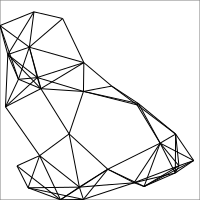

`ompl_multiset`
===============

Core planner implementation for the [Open Motion Planning Library (OMPL)][ompl].  Uses [Boost Graph][bgl] for the implementation.  Uses helpers for Boost Graph from the `pr_bgl` package.

Planners
--------

The primary planner is the `E8Roadmap`, a derived class of `ompl::base::Planner`.  It takes the following arguments:

* `const ompl::base::SpaceInformationPtr & si`
* `ompl_multiset::EffortModel & effort_model`,
* `ompl_multiset::TagCache & tag_cache`,
* `const RoadmapPtr roadmap_gen`,
* `unsigned int num_batches_init`

The roadmap input is an instance of a roadmap type which subclasses `ompl_multiset::Roadmap`.  Some of the classes implemented are described in the [Roadmaps](#roadmaps) section below.

Roadmaps
--------

This package contains classes called "roadmap generators" which generate roadmaps from OMPL state spaces into Boost Graph objects.  Here is a quick tour of roadmap types implemented so far:

### `RoadmapGenAAGrid`

Axis aligned grids.  One level.  Arguments: `res=0.16`.

### `RoadmapGenHalton`

Halton sequences with fixed connection radii.  One level.  Arguments: `n=30 radius=0.3`.

### `RoadmapGenHaltonDens`

Densified, batched Halton sequences with connection radii reduced at each batch according to dispersion estimate.  Infinite levels.  Arguments: `n_perbatch=30 radius_firstbatch=0.3`.  Shown here up to three subgraphs.

### `RoadmapGenRGG`

Random geometric graphs.  One level.  Arguments: `n=30 radius=0.3 seed=1`.

[bgl]: http://www.boost.org/doc/libs/release/libs/graph/
[ompl]: http://ompl.kavrakilab.org/
